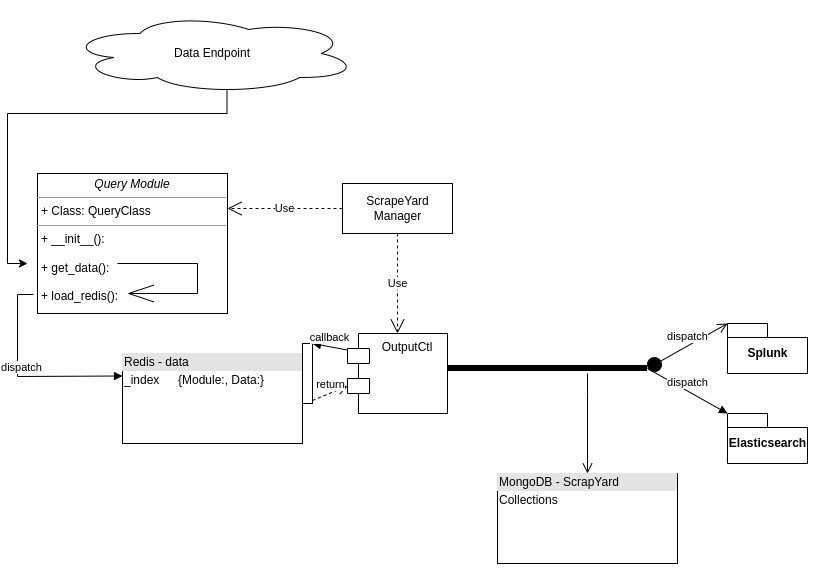

# ScrapeYard

A modular framework for querying novel data endpoints, sending the data to either splunk or elasticsearch
and managing them with simple YAML configurations. Designed with simplicity in mind, while keeping in mind 
that different endpoints may require different "craziness" in order to work. Modules may be as complex as
needed without impact overall framework simplicity. Each module exists in its own thread, and is responsible
for any data retrieval and processing. Modules that crash are automatically restarted at the default interval.

<p align="center">
  
</p>


## Database Schema

Scrapeyard relies on Redis and MongoDB for queueing and local retention of all data.
Redis provides a message queue for the ingest modules, allowing for easier pipelining of outputs.
MongoDB provides a document based store for all messages that pass through the pipeline. 

Scrapeyard relies on the local developer to properly schema the data coming out of the ingest modules,
as all documents are created for each ingest module, and are written to a single "ScrapeYard" database.
The required JSON schema being pushed to Redis must be as follows:

``` 
{ "Module": "Example",
  "Data": { "NESTED": "JSON", "DATA": "HERE" }, 
  }
```
This ensures each ingest module has its own MongoDB collection, for ease of later querying and add-ons. 

## Testing

Scrapeyard provides a module validator, located in the tests directory.

This will test the following:
 - Redis accessibility
 - Existence of class "QueryClass"
 - Proper loading of Redis database with data
 - Is the data proper JSON

Important note - As ingest modules are generally designed to persistently run in their own thread,
the module unit test starts a new thread, waits a second, then kills the thread. Since this may add 
data to Redis that you do not want processed, a FlushAll command is issued to the Redis database. 
__With this in mind, it is recommended that all unit testing occurs on non-production devices.__

## YAML breakdown

```
Manager:
  UpdatePeriod: 300     --- How often the YAML is re-read for configuration changes.
Modules:
  Ingest:               --- Modules (placed inside the "ingest" directory) that get run
    - LiveMap
    - PowerOutage
  Output:               --- Modules (placed inside the "output" directory) that get run
    - Splunk
    - Elasticsearch
Databases:              --- Database information. Redis and mongodb are both required.
  Redis:
    Host: '127.0.0.1'
    Port: '6379'
    Credentials: 'username:password'
  Mongodb:
    Host: '127.0.0.1'
    Port: '27019'
    Credentials: 'username:password'
```


## Minimum required code for a module

Note: This is minimum required for a module to RUN and properly load Redis. The below code is from the Example module, 
which loads a single static JSON entry.
```
class QueryClass:
    def __init__(self):
        self.data = ""
        self.QueryTime = 10
        self.n = self.QueryTime
        parsed_yaml = manager.config.get_config()
        while True:
            if self.n >= self.QueryTime:
                self.n = 0
                self.load_redis(parsed_yaml)
            time.sleep(1)
            self.n += 1
            if not exists("ingest.Example.lck"):
                break

    def load_redis(self, parsed_yaml):
        redis_host = parsed_yaml['Databases']['Redis']['Host']
        redis_port = parsed_yaml['Databases']['Redis']['Port']
        r = redis.Redis(host=redis_host, port=redis_port)
        self.retrieve_data()
        try:
            r.rpush("data", self.data)
        except:
            print("Example : Unable to push to Redis stack")

    def retrieve_data(self):
        self.data = '{"Module":"Example", "Data": {"name":"John", "age":30, "car":"civic"}}'
```

## Sample Code Dissected:
 - ``` class QueryClass: ```
   - The class called by the ingest manager.
 - ``` self.QueryTime = 10```
   - The time in seconds between each loop.
 - ```def __init__(self):```
   - The function that is called by the manager. Is required for the module to be properly called.
 - ``` self.n = self.QueryTime```
   - Sets the counter to "QueryTime" in order to run once before reseting the counter to zero and starting the loop
 - ``` if not exists("ingest.MODULE_NAME.lck"): ```
   - Looks for the setting update file. If it does not exist, exit out of the module. 
 - ``` def load_redis(self, parsed_yaml): ```
   - Function to load redis with data.